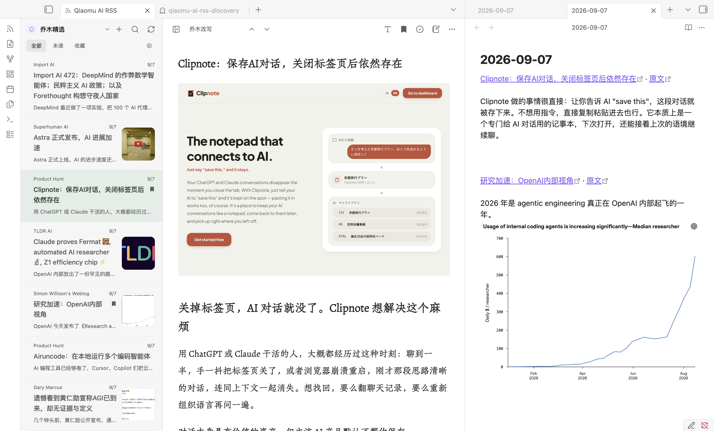
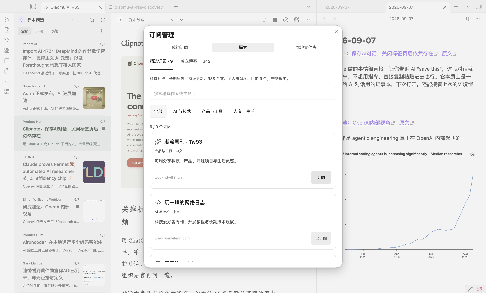
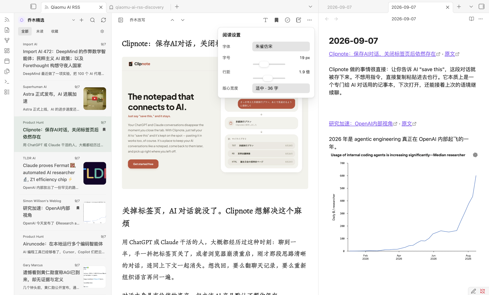

# Qiaomu AI RSS · 乔木 RSS

**[在 Obsidian 官方插件库安装 · Install](https://community.obsidian.md/plugins/qiaomu-ai-rss)**

在 Obsidian 中阅读 [乔木 RSS](https://rss.qiaomu.ai/) 精选文章，也可以添加自己的 RSS / Atom 订阅，把值得记住的文章链接加入今日日记。

播客条目可在阅读页收听音频；YouTube 视频条目打开后直接显示嵌入播放器预览，点击播放器即可播放。媒体不可用时仍可打开原文。

Read Qiaomu feeds and your own RSS / Atom subscriptions in a native Obsidian view, switch between original articles and available Chinese AI rewrites or translations, and add article links to your Daily Note.



## 功能

- **频道切换**：桌面端就近弹出分组菜单，手机端使用底部面板；支持搜索、键盘选择和订阅分组展开。每个频道独立保存文章、列表/正文位置及筛选搜索条件；切回或重开插件时恢复，重复选择当前频道不会重置。已访问频道保留加载的列表，点击刷新获取新内容。

- **探索订阅**：9 个精选作者与 1,342 个中文独立博客，支持搜索和一键订阅。乔木博客作为内置频道提供。

- **库内 Markdown**：在插件设置中通过原生文件夹搜索选择剪藏目录或其他文件夹，频道菜单即可阅读其中及子目录的 Markdown。正文使用 Obsidian 原生渲染，支持本地附件和内部链接；刷新列表或重新打开文章可读取变化。
- **我的订阅**：添加 RSS / Atom 地址、重命名、分组、取消订阅；OPML 导入预览、去重与导出。个人订阅直接在本机获取，无需乔木账号。

- 阅读优先双栏：紧凑工具栏、可拖动调宽的列表、一键专注阅读；有配图的文章在列表中显示本地缓存缩略图。
- 分组频道选择器：聚合、个人分组、乔木频道和订阅源各自归类，使用图标或名称缩写快速识别。
- 插件设置和正文工具栏共用阅读设置，前台面板跟随吸顶工具栏：内置朱雀仿宋常用字集，以及系统宋体/黑体和自选设备字体；支持 14–32px 字号、1.5–2.4 倍行距和 28/36/44 字版心宽度；调整立即生效并在重启后保留。
- 浏览所有频道的最近 100 篇文章；单个频道按游标加载更早文章。
- 搜索当前载入的文章，按未读、收藏筛选。
- 切换乔木改写、中文翻译、原文。没有生成的版本会明确显示缺失，不自动调用 AI。
- 桌面端可从文章的「更多」菜单将当前阅读版本保存为 Markdown 或导出为 PDF，保存时自行选择位置和文件名；Markdown 图片另存为相邻资源文件夹，PDF 不包含播放器和工具栏。
- 已读状态、本地收藏，以及最近 40 篇打开过的文章缓存。收藏文章另外保留完整内容。
- 点击“记到今日日记”，以普通段落追加文章标题、内部回跳链接及“原文”链接，并在桌面端分屏打开今日日记；日记不存在时自动创建，重复点击不重复写入。
- 摘录浮层默认开启，可在插件设置的“阅读与摘录”中关闭；选中正文可摘录到今日日记或当前笔记，也可将选中文字拖入处于编辑模式的笔记。日记中同篇文章只保留一个标题链接，后续摘录归入该文章段落。内部链接会在 RSS 阅读器中打开保存的文章版本；本地副本独立于最近文章缓存保留，依赖插件及其数据。
- 已加载的图片可拖入处于编辑模式的笔记，由 Obsidian 保存到配置的附件位置并插入本地图片引用。支持 RSS 图片和库内 Markdown 图片，支持 PNG、JPEG、GIF、WebP、AVIF（最多 8 MB）。
- 装了[乔木Home](https://github.com/joeseesun/qiaomu-home)时，主页显示最新未读文章与未读数，主页搜索框也能搜到文章；主页只读本机已有文章，不触发刷新。
- 外部正文经过 HTML 清理，脚本、嵌入页面与可执行代码块不会运行。文章图片默认显示，下载到本地缓存后再渲染。

本插件参考自有 [QMReader iOS](https://github.com/joeseesun/qmreader-ios) 的产品交互，根据 [QMReader 服务](https://github.com/joeseesun/qmreader) 的公共 API 独立开发。它不是其他 Obsidian RSS 插件的 fork。

## 安装

需要 Obsidian **1.13.0 或更新版本**。

### 官方插件库

打开 [官方插件页面](https://community.obsidian.md/plugins/qiaomu-ai-rss)，查看审核状态并点击 **Add to Obsidian** 安装。也可以在 Obsidian 第三方插件的浏览页面搜索 **Qiaomu AI RSS**。若客户端暂未列出，可使用下方 BRAT 或手动安装。

以下 BRAT 与手动安装方式仍然可用。

### BRAT

安装 BRAT 后，添加仓库 `joeseesun/qiaomu-ai-rss`，启用 **Qiaomu AI RSS**。

### 手动安装

1. 从 [Releases](https://github.com/joeseesun/qiaomu-ai-rss/releases) 下载 `main.js`、`manifest.json`、`styles.css`。
2. 在当前库的配置目录（默认 `.obsidian`）下创建 `plugins/qiaomu-ai-rss/`，将三个文件放入该文件夹。
3. 在 Obsidian 的第三方插件设置中启用 **Qiaomu AI RSS**。
4. 点击侧边栏 RSS 图标，或运行命令 **Qiaomu AI RSS: 打开乔木 RSS 阅读器**。

GitHub 发布和官方目录审核是独立流程；每个版本的审核结果以官方页面为准。

## 使用

### 探索订阅



点击列表顶部 **+ → 探索**，或运行命令 **Qiaomu AI RSS: 探索订阅**。

- **精选订阅**：首批只保留潮流周刊、阮一峰、云风、和菜头、张鑫旭、小众软件、月光博客、Reorx 与 pseudoyu。标准是长期原创、持续更新、RSS 全文与鲜明的个人辨识度，宁缺毋滥；乔木博客直接作为内置频道提供。
- **独立博客**：来自 [timqian/chinese-independent-blogs](https://github.com/timqian/chinese-independent-blogs) 的 1,342 个带 RSS 地址的博客，保留名称、主页与主题标签；支持搜索、主题筛选和分批浏览。
- **微信公众号**：提供赛博禅心、数字生命卡兹克、新智元等 8 个由 `rss.t5t6.com/weread/` 生成的公开 RSS，逐个选择订阅，不会自动加入。部分文章只有摘要和原文链接；该服务若不可用，已有本地缓存仍可阅读。
- **播客**：展示 Qiaomu Reader 服务返回的已启用小宇宙节目，以及精选的 10 个海外节目；也可搜索更多海外节目并订阅。乔木精选默认列表优先展示张小珺、Next Token、42章经、晚点聊和半拿铁各自最新一期，这五个节目也默认出现在「乔木频道」，无需先订阅；其他节目仍可单独订阅。All-In 与 Joe Rogan 的节目单和文稿统一来自 Podscribe API，避免将 YouTube Shorts 当成完整单集；只有与现有视频频道标题及日期唯一匹配的完整单集才显示 YouTube 播放器和视频链接。其他海外节目若在单集说明中明确提供本期 YouTube 视频直链，也会显示播放器；其余通过节目原页访问音视频。已有这两个视频频道订阅会切到完整节目，原有收藏和已读记录保留。插件读取服务端已有内容；有现成乔木改写时可查看改写稿，直接读取的 Podscribe 单集目前只有源文稿，小宇宙完整逐字稿尚未接入。订阅本身不会触发服务端自动转写，播客音频仍通过原站链接访问。
- 用户订阅的海外播客在「已订阅播客」分组，不触发服务端自动乔木改写；精选小宇宙节目留在「乔木频道」。All-In 单集若能匹配现有中文译名、Joe Rogan 单集若含期号，会在中文标题下显示英文原标题。缺少中文译名的单集仍显示原题。
- **微信公众号**：同样在探索页新增入口，读取当前配置的 Qiaomu Reader 服务支持的完整公开 RSS 目录并支持搜索；目录不可用时仍可使用内置精选源。
- 点击“订阅”会读取并验证源，按主题加入“我的订阅”，并让阅读器记住这个新频道；切回阅读器即可看到文章。已经添加的源显示“已订阅”，点击“开始阅读”可查看全部个人订阅。
- 精选、海外播客推荐与博客目录离线内置；小宇宙播客列表从 Qiaomu Reader 服务读取。进入公众号目录或搜索海外播客时会请求在线目录。播客单集与已有内容从服务读取；完整逐字稿的可用性取决于来源。添加失败时显示原因和重试入口。

[目录来源、授权与可用性记录](docs/DISCOVERY.md) · [精选目录截图](docs/images/listing-2026-09/explore.png)

### 添加自己的订阅

1. 点击列表顶部 **+**，或运行命令 **Qiaomu AI RSS: 管理我的订阅**。
2. 粘贴完整的 RSS / Atom 订阅地址，填写可选分组，点击“添加”。名称和文章会从订阅源读取。
3. 从探索页添加的订阅会直接成为阅读器当前频道。也可以点击列表顶部的频道名称，在搜索弹窗中选择“我的订阅”、某个分组或具体订阅源；“乔木精选”仍可随时切回。
4. 订阅管理中的铅笔按钮可修改名称与分组；垃圾桶可取消订阅，已收藏文章和今日日记中的链接会保留。

个人源默认且仅提供原文，复用收藏、已读、搜索、本地图片与今日日记功能，不会调用乔木 AI 接口。部分源只提供摘要，可从文章菜单打开原文。

**OPML**：在订阅管理中选择“导入 OPML”，选择文件或粘贴内容，确认预览后导入；重复地址自动跳过，不覆盖已有名称和分组。嵌套分组合并成路径名称。导入后点击刷新获取文章。“导出 OPML”将当前个人订阅写入设置中的 OPML 导出文件夹，文件名为 `subscriptions-时间戳.opml`。

最多 100 个个人源，每源保留订阅文件前 200 条中的最多 50 篇（总正文约 1 MB）；单篇超过 100,000 字符会截断并提示打开原文。刷新使用稳定文章 ID，保留已读与收藏；失败时保留旧文章。选择个人频道时，超过 5 分钟的缓存会刷新；刷新按钮强制获取。无定时后台轮询。

### 阅读与保存



点击列表顶部的当前频道，按聚合、分组、乔木频道和个人订阅源浏览或搜索。正文顶部的版本菜单切换原文、中文翻译和乔木改写；点击字体图标可调整正文字体、字号、行距与版心宽度，所见即所得并自动保存，点击面板外部关闭。拖动两栏之间的分隔线调整列表宽度，双击复位；按 `[` 或点击侧栏图标专注阅读，按 `j` / `k` 切换文章。点击笔记图标后，插件会遵循 Obsidian 核心“日记”插件的文件夹、日期格式和模板设置，以普通段落追加文章标题的内部回跳链接 并分屏打开该文件。

搜索只覆盖当前加载列表（收藏模式下为本地收藏）；要读更多历史文章，请选择具体频道，再点击“加载更早文章”。全文与各版本取决于服务实际提供的内容，部分订阅只含摘要。

本地收藏、已读和缓存存储于当前库的插件数据中，不与网站账户或 iOS 收藏自动同步。离线时可以使用已缓存的最近列表和正文；新频道与未缓存正文仍需联网。AI 内容可能有误，建议对照原文。

## 隐私与网络 / Privacy and network use

- **Discovery.** Featured feeds, ten podcast recommendations, and blog search are local. Opening or searching the WeChat catalog and searching podcasts send requests to the configured Qiaomu Reader service. Podcast episodes and available source transcripts are read from that service; subscribing does not initiate AI rewriting. Clicking Subscribe on a personal RSS feed fetches the chosen feed.

- **Network required for new content.** Opening the reader, selecting a channel/article or refreshing sends anonymous HTTPS GET requests to `https://rss.qiaomu.ai`, or the compatible HTTPS origin you explicitly configure. The service receives normal request metadata such as IP address, request time and requested article/channel IDs. See [Privacy](docs/PRIVACY.md).
- **Personal feed requests go directly to the URLs you add or import.** These HTTP(S) hosts receive normal request metadata; feed addresses, groups and article bodies are not uploaded to Qiaomu. OPML import itself does not fetch content. Feed URLs may contain private access tokens and are stored unencrypted in plugin data and OPML exports; keep those exports private.
- **No account, API key or payment is required for the public reading features in this release.** This plugin only reads existing published AI assets. It does not request new AI generation or send data to model providers. Future service availability is controlled by the service operator.
- **Article images are enabled by default.** The plugin downloads article images and list thumbnails from their hosts and displays local Blob URLs. Images are cached within this plugin’s vault configuration directory (up to 64 MB / 100 files, 8 MB per image). Image hosts receive normal image requests; cached images can be read offline. You can disable images in settings. Clicking article links opens the linked website in your browser.
- **Media playback is user-initiated.** Podcast audio is fetched from the media URL supplied by the selected entry when played. Opening a YouTube article loads a sandboxed YouTube player preview without autoplay; YouTube may receive normal request metadata and apply its own privacy policy before playback. See [Privacy](docs/PRIVACY.md).
- **About-page QR images.** Opening the About settings tab loads the reward and public-account QR images from `https://radio.qiaomu.ai`; that host receives normal image request metadata. The images are not loaded while reading articles.
- **No client-side analytics, ads, automatic updates or installation of dependencies.** The plugin does not upload vault notes or send local search queries, favorites or read markers to the service. There is no plugin-specific analytics endpoint. The service may retain ordinary HTTP access/error logs; this plugin does not load the website's analytics scripts. Opening a YouTube article loads third-party code inside its restricted iframe.
- **Vault-local storage only.** Settings, personal subscriptions with cached entries, recent Qiaomu entries, up to 40 recently opened articles, favorites, local images and up to 5,000 read IDs are saved using Obsidian plugin storage. Captured article snapshots are retained for internal return links even after cache eviction; deleting plugin data breaks those links. Favorites remain until removed; large libraries can increase the size of `data.json`. If you sync your vault's configuration, your sync provider may also sync these files. The note action appends the article title with an internal reader link and optionally selected text to today's Daily Note in the vault. No files outside the vault are read or written.
- Switching service origins clears the previous Qiaomu service's local reader data and favorites; personal subscriptions and personal favorites remain. Back up your plugin data before switching.

## 开发

```sh
npm ci
npm run check
npm run test:live  # read-only requests to the production public API
# In the disposable Qiaomu RSS QA vault only:
node scripts/subscription-smoke.mjs
node scripts/discovery-smoke.mjs
node scripts/discovery-layout.mjs
```

`npm run dev` 监听 TypeScript 变化。构建产物为根目录 `main.js`，将其与 `manifest.json`、`styles.css` 安装到专用测试库即可。

阅读功能使用 Obsidian 和 Web API；桌面端的 Markdown 与 PDF 导出会调用 Obsidian 内的 Electron 和 Node.js 文件接口，以保存到用户选择的位置。移动端不会显示导出操作。`isDesktopOnly: false` 表示阅读功能兼容移动环境；移动真机测试状态见 [验收记录](docs/VALIDATION.md)。

- [API 契约](docs/API.md)
- [官方目录发布记录](docs/SUBMISSION.md)
- [贡献与版本迭代](CONTRIBUTING.md)

## License / 许可证

Copyright (c) 2026 向阳乔木.

本项目整体采用 **GNU GPL v3.0 only**（`GPL-3.0-only`），完整条款见 [LICENSE](LICENSE)。除另有明确声明的第三方部分外，自有代码可按 GPL v3.0 使用、修改和分发，不提供任何担保。第三方代码、字体及素材保留各自许可证与版权声明。

GPL 允许免费商业使用；分发时须遵守相应源码、版权和许可证义务。需要 GPL 之外的授权，可联系作者协商[商业授权](COMMERCIAL-LICENSE.md)。本次变更不撤销此前已授予的许可证。

The project as a whole is licensed under GNU GPL version 3 only, with no warranty. Third-party components retain their own licenses. Commercial use is permitted under GPL; a separate commercial agreement may be negotiated for rights the author can grant. Previously granted licenses remain valid.

此前 MIT 版本声明保留在 [LICENSES/previous-MIT.txt](LICENSES/previous-MIT.txt)。

Bundled dependencies retain their licenses: DOMPurify (Apache-2.0 OR MPL-2.0), marked (MIT), Zod (MIT), Turndown (MIT), and Turndown GFM (MIT). See [third-party notices](THIRD_PARTY_NOTICES.md).

[X / 向阳乔木](https://x.com/vista8) · [GitHub](https://github.com/joeseesun)

仅内置朱雀仿宋常用字集，离线可用，按选择加载；`main.js` 小于 5 MB。其他字体使用设备已安装字体。朱雀仿宋采用 SIL OFL 1.1 授权，见 [字体来源与授权](fonts/README.md)。

### 库内文件夹来源

点击列表顶部 + → 本地文件夹 → 添加文件夹或添加文件，使用 Obsidian 内置搜索选择。输入目录名进行模糊搜索，选择后立即进入该频道。可添加多个文件夹，移除来源不会删除文件。剪藏的 title 属性用作标题，source 或 url 属性用作原文地址；没有网页地址的本地文件提供源笔记链接。未配置文件夹时不扫描库内 Markdown，文件夹来源不调用乔木 API。
