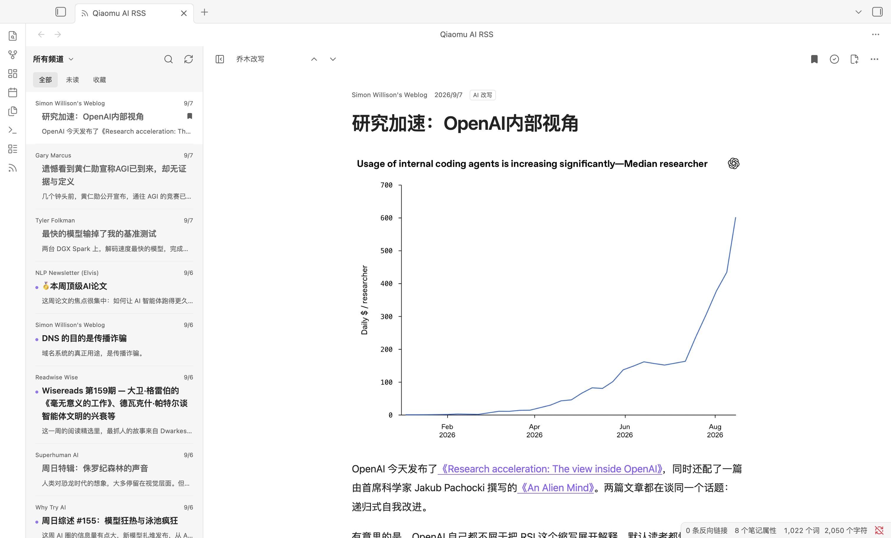
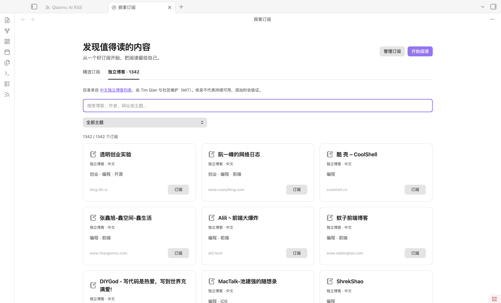
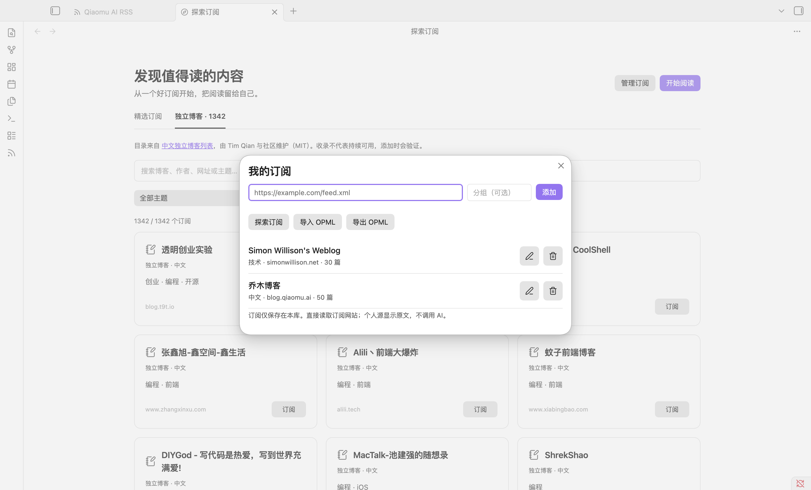

# Qiaomu AI RSS · 乔木 RSS

在 Obsidian 中阅读 [乔木 RSS](https://rss.qiaomu.ai/) 精选文章，也可以添加自己的 RSS / Atom 订阅，把值得留存的内容保存为 Markdown 笔记。

Read Qiaomu feeds and your own RSS / Atom subscriptions in a native Obsidian view, switch between original articles and available Chinese AI rewrites or translations, and save articles to your vault.



## 功能

- **探索订阅**：12 个精选源与 1,342 个中文独立博客，按名称/主题搜索、一键订阅；支持 RSSHub 与自定义实例。
- **我的订阅**：添加 RSS / Atom 地址、重命名、分组、取消订阅；OPML 导入预览、去重与导出。个人订阅直接在本机获取，无需乔木账号。

- 阅读优先双栏：44px 正文工具栏、可拖动调宽的列表、一键专注阅读；窄屏使用列表与正文两级导航。
- 浏览所有频道的最近 100 篇文章；单个频道按游标加载更早文章。
- 搜索当前载入的文章，按未读、收藏筛选。
- 切换乔木改写、中文翻译、原文。没有生成的版本会明确显示缺失，不自动调用 AI。
- 已读状态、本地收藏，以及最近 40 篇打开过的文章缓存。收藏文章另外保留完整内容。
- 保存为 Markdown 笔记，带原文链接、频道、阅读版本和导入时间。重复保存同一标题、文章和版本会打开已有文件，不覆盖编辑。
- 外部正文经过 HTML 清理，脚本、嵌入页面与可执行代码块不会运行。文章图片默认显示，下载到本地缓存后再渲染。

本插件参考自有 [QMReader iOS](https://github.com/joeseesun/qmreader-ios) 的产品交互，根据 [QMReader 服务](https://github.com/joeseesun/qmreader) 的公共 API 独立开发。它不是其他 Obsidian RSS 插件的 fork。

## 安装

需要 Obsidian **1.13.0 或更新版本**。正式收录前，可使用以下方式安装。

### BRAT

安装 BRAT 后，添加仓库 `joeseesun/qiaomu-ai-rss`，启用 **Qiaomu AI RSS**。

### 手动安装

1. 从 [Releases](https://github.com/joeseesun/qiaomu-ai-rss/releases) 下载 `main.js`、`manifest.json`、`styles.css`。
2. 在当前库的配置目录（默认 `.obsidian`）下创建 `plugins/qiaomu-ai-rss/`，将三个文件放入该文件夹。
3. 在 Obsidian 的第三方插件设置中启用 **Qiaomu AI RSS**。
4. 点击侧边栏 RSS 图标，或运行命令 **Qiaomu AI RSS: 打开阅读器**。

官方插件目录收录是独立审核流程。公开仓库和 GitHub Release 不代表已经获得官方批准。

## 使用

### 探索订阅



点击列表顶部 **+ → 探索订阅**，或运行命令 **Qiaomu AI RSS: 探索订阅**。

- **精选订阅**：乔木博客、少数派、爱范儿、NASA 等，以及 RSSHub 的 36氪快讯和 GitHub 今日趋势。
- **独立博客**：来自 [timqian/chinese-independent-blogs](https://github.com/timqian/chinese-independent-blogs) 的 1,342 个带 RSS 地址的博客，保留名称、主页与主题标签；支持搜索、主题筛选和分批浏览。
- 点击“订阅”会读取并验证源，按主题加入“我的订阅”，已经添加的源显示“已订阅”。点击“开始阅读”进入个人文章列表。
- 目录离线内置，不会在浏览时请求所有网站。独立博客是社区目录快照，部分旧地址可能失效；添加失败时显示原因和重试入口。
- RSSHub 默认使用第三方公共实例 `rsshub.rssforever.com`，可以展开“RSSHub 实例”改为自己的 HTTPS 实例。仅影响以后添加的源，已有订阅保持不变。

[目录来源、授权与可用性记录](docs/DISCOVERY.md) · [精选目录截图](docs/images/discovery-featured.png)

### 添加自己的订阅



[个人阅读界面](docs/images/personal-reader.png) · [窄屏订阅管理](docs/images/subscriptions-narrow.png)

1. 点击列表顶部 **+**，或运行命令 **Qiaomu AI RSS: 管理我的订阅**。
2. 粘贴完整的 RSS / Atom 订阅地址，填写可选分组，点击“添加”。名称和文章会从订阅源读取。
3. 点击列表顶部的频道名称，在搜索弹窗中选择“我的订阅”、某个分组或具体订阅源。“乔木精选”仍可随时切回。
4. 订阅管理中的铅笔按钮可修改名称与分组；垃圾桶可取消订阅，已收藏文章和已保存笔记会保留。

个人源默认且仅提供原文，复用收藏、已读、搜索、本地图片与保存笔记功能，不会调用乔木 AI 接口。部分源只提供摘要，可从文章菜单打开原文。

**OPML**：在订阅管理中选择“导入 OPML”，选择文件或粘贴内容，确认预览后导入；重复地址自动跳过，不覆盖已有名称和分组。嵌套分组合并成路径名称。导入后点击刷新获取文章。“导出 OPML”将当前个人订阅写入设置中的笔记文件夹，文件名为 `subscriptions-时间戳.opml`。

最多 100 个个人源，每源保留订阅文件前 200 条中的最多 50 篇（总正文约 1 MB）；单篇超过 100,000 字符会截断并提示打开原文。刷新使用稳定文章 ID，保留已读与收藏；失败时保留旧文章。选择个人频道时，超过 5 分钟的缓存会刷新；刷新按钮强制获取。无定时后台轮询。

### 阅读与保存

点击列表顶部的频道名称打开可搜索的频道选择器，点击放大镜或按 `/` 搜索。正文顶部的版本菜单切换原文、中文翻译和乔木改写。拖动两栏之间的分隔线调整列表宽度，双击复位；按 `[` 或点击侧栏图标专注阅读，按 `j` / `k` 切换文章。工具栏提供收藏、已读切换、保存笔记和打开原文。默认保存位置为 `Qiaomu RSS/`，可在设置中修改。

搜索只覆盖当前加载列表（收藏模式下为本地收藏）；要读更多历史文章，请选择具体频道，再点击“加载更早文章”。全文与各版本取决于服务实际提供的内容，部分订阅只含摘要。

本地收藏、已读和缓存存储于当前库的插件数据中，不与网站账户或 iOS 收藏自动同步。离线时可以使用已缓存的最近列表和正文；新频道与未缓存正文仍需联网。AI 内容可能有误，建议对照原文。

## 隐私与网络 / Privacy and network use

- **Network required for new content.** Opening the reader, selecting a channel/article or refreshing sends anonymous HTTPS GET requests to `https://rss.qiaomu.ai`, or the compatible HTTPS origin you explicitly configure. The service receives normal request metadata such as IP address, request time and requested article/channel IDs. See [Privacy](docs/PRIVACY.md).
- **Discovery is local.** Catalog search/filtering sends no network requests. Clicking Subscribe contacts the listed feed host, or the displayed RSSHub instance for RSSHub routes. Blog home-page/source links open only when clicked. See [catalog provenance](docs/DISCOVERY.md).
- **Personal feed requests go directly to the URLs you add or import.** These HTTP(S) hosts receive normal request metadata; feed addresses, groups and article bodies are not uploaded to Qiaomu. OPML import itself does not fetch content. Feed URLs may contain private access tokens and are stored unencrypted in plugin data and OPML exports; keep those exports private.
- **No account, API key or payment is required for the public reading features in this release.** This plugin only reads existing published AI assets. It does not request new AI generation or send data to model providers. Future service availability is controlled by the service operator.
- **Article images are enabled by default.** The plugin downloads raster images from their hosts and displays local Blob URLs. Images are cached within this plugin’s vault configuration directory (up to 64 MB / 100 files, 8 MB per image). Image hosts receive normal image requests; cached images can be read offline. You can disable images in settings. Exported notes retain the original remote image URLs. Clicking article links opens the linked website in your browser. When disabled, no article images are embedded or exported.
- **No client-side analytics, ads, remote executable code, automatic updates or installation of dependencies.** The plugin does not upload vault notes or send local search queries, favorites or read markers to the service. There is no plugin-specific analytics endpoint. The service may retain ordinary HTTP access/error logs; this plugin does not load the website's analytics scripts.
- **Vault-local storage only.** Settings, personal subscriptions with cached entries, recent Qiaomu entries, up to 40 recently opened articles, favorites, local images and up to 5,000 read IDs are saved using Obsidian plugin storage. Favorites remain until removed; large libraries can increase the size of `data.json`. If you sync your vault's configuration, your sync provider may also sync these files. Explicitly saving an article creates a Markdown file in your chosen vault folder. No files outside the vault are read or written.
- Switching service origins clears the previous Qiaomu service's local reader data and favorites; personal subscriptions and personal favorites remain. Back up your plugin data before switching.

## 开发

```sh
npm ci
npm run check
npm run test:live  # read-only requests to the production public API
# In the disposable Qiaomu RSS QA vault only:
node scripts/subscription-smoke.mjs
node scripts/discovery-smoke.mjs
node scripts/discovery-layout.mjs
```

`npm run dev` 监听 TypeScript 变化。构建产物为根目录 `main.js`，将其与 `manifest.json`、`styles.css` 安装到专用测试库即可。

运行时仅使用 Obsidian 和 Web API，不依赖 Node.js 或 Electron。`isDesktopOnly: false` 表示代码兼容移动环境；移动真机测试状态见 [验收记录](docs/VALIDATION.md)。

- [API 契约](docs/API.md)
- [官方目录提交准备](docs/SUBMISSION.md)
- [贡献与版本迭代](CONTRIBUTING.md)

## License

MIT. Copyright (c) 2026 向阳乔木.

Bundled dependencies retain their licenses: DOMPurify (Apache-2.0 OR MPL-2.0), marked (MIT), Turndown (MIT), and Zod (MIT). See [third-party notices](THIRD_PARTY_NOTICES.md).

[X / 向阳乔木](https://x.com/vista8) · [GitHub](https://github.com/joeseesun)
